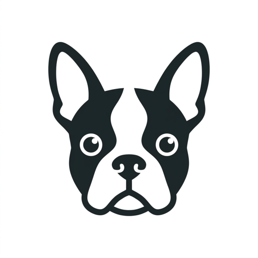

# NogPets MCP server

Book mobile dog grooming, walks and pet sitting in Stellenbosch, South Africa, from any AI assistant. Pet businesses can register with NogPets the same way.

This repo describes the hosted server. There is nothing to install.

| | |
| --- | --- |
| **URL** | `https://mcp.nogpets.com/mcp` |
| **Transport** | Streamable HTTP |
| **Auth** | OAuth 2.1 + PKCE (client ID metadata documents and dynamic client registration; no client id or secret needed) |
| **Docs** | https://nogpets.com/developers/mcp |
| **REST API** | https://nogpets.com/openapi.json |
| **Registry** | `com.nogpets/nogpets` on the official MCP Registry |

## Connect

- **ChatGPT**: Settings → Security and login → Developer mode on → chatgpt.com/plugins → **+** → paste the URL → OAuth.
- **Claude**: Customize → Connectors → Add custom connector → paste the URL.
- **Claude Code**: `claude mcp add --transport http nogpets https://mcp.nogpets.com/mcp`
- **VS Code, Cursor, Windsurf, Gemini CLI, Zed**: add a remote (HTTP) MCP server with the URL.

You sign in to NogPets once and choose what the assistant may do. Disconnect any time in the NogPets app → Profile → Connected assistants.

## Try

- "Do you groom dogs in Die Boord? What does a full groom cost for a 9 kg Boston terrier?"
- "Book a full groom for Bokkie next week, any morning."
- "What bookings do I have coming up?"
- "Register my dog grooming business with NogPets."

## Tools

Read only: `list_services`, `check_coverage`, `get_quote`, `find_times`, `my_profile`, `list_pets`, `list_addresses`, `list_bookings`, `get_booking`, `find_reschedule_times`, `find_pet_businesses`, `get_signup_status`.

Actions: `add_pet`, `add_address`, `book`, `reschedule_booking`, `cancel_booking`, `pay_booking`.

Business sign-up: `start_business_signup`, `add_business_services`, `set_service_area`, `add_resources`, `set_operating_hours`, `invite_staff`, `connect_payfast`, `submit_business_for_review`.

Every tool has a title and read-only / destructive / idempotent / open-world hints.

## Safety

- **The assistant never pays.** A card booking returns a Payfast link the person opens. Cash bookings, cancellations and business submissions need an explicit yes.
- No card data reaches the assistant or our API. `connect_payfast` stores a merchant id only, never a key or passphrase.
- Every action is logged with the assistant's name. Tokens are scoped, expire and can be revoked.
- New businesses are reviewed by NogPets before anything goes live.

## Contact

hello@nogpets.com · https://nogpets.com/support · [Privacy](https://nogpets.com/privacy) · [Terms](https://nogpets.com/terms)

NogPets is a trading name of Peak Software (Pty) Ltd, South Africa.
